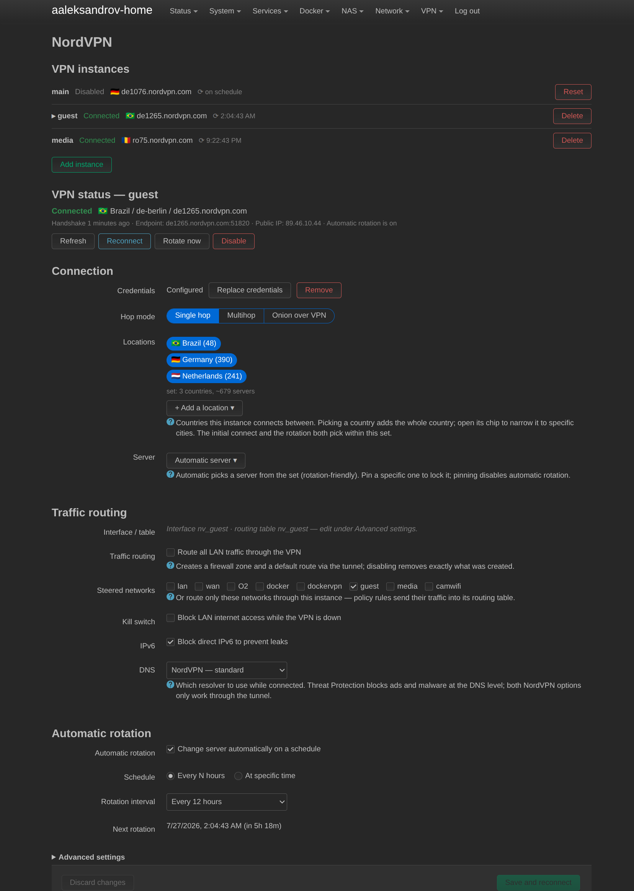
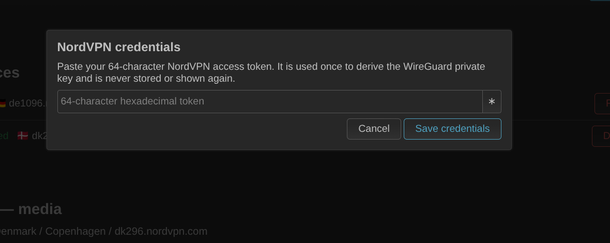
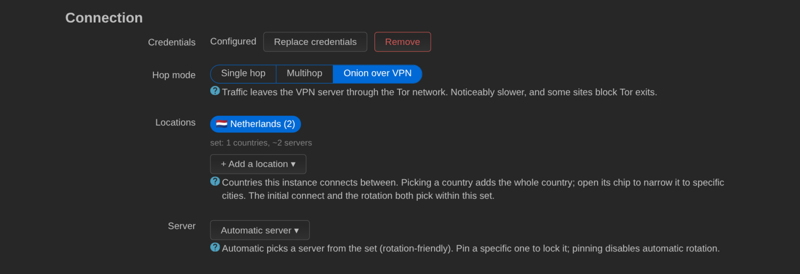
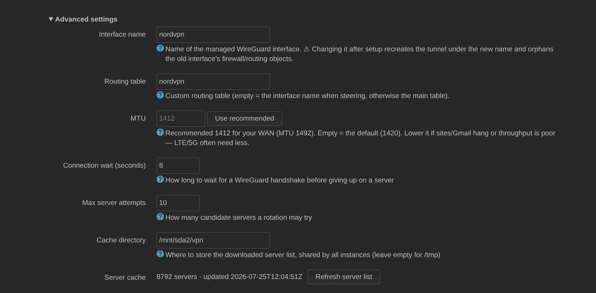
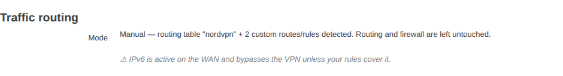

# NordVPN WireGuard for OpenWrt

Configure NordVPN's WireGuard (NordLynx) service on OpenWrt, with a one-time
credential exchange, country/city/server selection, automatic rotation, custom
routing tables and a native LuCI page.

> **Unofficial.** This project is not affiliated with, endorsed by, or supported
> by Nord Security. "NordVPN" and "NordLynx" are trademarks of their respective
> owners. Use your own NordVPN account and access token.



## Architecture

The project ships as **two packages** so the VPN service is useful without a web
interface and the LuCI app stays a thin frontend:

- **`nordvpn-wireguard`** — the backend (targets `openwrt/packages`,
  `net/nordvpn-wireguard`). ucode + procd + an rpcd/ubus object. Does credential
  exchange, server-list caching, WireGuard interface/peer generation,
  handshake verification, scheduled rotation and runtime status. Works from the
  CLI and over ubus with no LuCI installed.
- **`luci-app-nordvpn`** — the LuCI frontend (targets `openwrt/luci`,
  `applications/luci-app-nordvpn`). A JavaScript view that calls the backend's
  ubus methods. Performs no privileged filesystem or network-config operations
  itself.

The browser never receives the access token or the WireGuard private key.

## Repository layout

```
nordvpn-wireguard/                         # backend package (packages feed)
├── Makefile
├── test.sh                                # CI version smoke test
├── files/etc/config/nordvpn               # non-secret settings (owns config)
├── files/etc/init.d/nordvpn               # consolidated procd service
├── files/etc/uci-defaults/90-nordvpn-migrate
├── files/usr/bin/nordvpn-service          # uloop scheduler daemon
├── files/usr/bin/nordvpn-cache-update     # one-shot cache worker
├── files/usr/bin/nordvpn-rotate           # one-shot rotation worker
├── files/usr/share/rpcd/ucode/nordvpn.uc  # ubus object 'nordvpn'
├── files/usr/share/ucode/nordvpn/*.uc     # shared ucode modules
└── tests/                                 # offline ucode fixture/unit tests

luci-app-nordvpn/                          # LuCI frontend (luci feed)
├── Makefile
├── htdocs/luci-static/resources/view/nordvpn/overview.js
├── po/templates/nordvpn.pot
└── root/usr/share/{luci/menu.d,rpcd/acl.d}/luci-app-nordvpn.json

docs/screenshots/                          # LuCI page screenshots (README)
```

## Supported releases

- **Primary:** current OpenWrt master / snapshots (uses `apk`).
- **Secondary:** OpenWrt 25.12 where APIs and dependencies match.
- Older releases only via a separately maintained downstream build.

## Installation

### From a package feed / snapshot build

Build with the OpenWrt SDK for your target. The backend is a plain packages-feed
package; the LuCI app builds inside an `openwrt/luci` checkout.

```bash
# backend (packages feed style)
cp -r nordvpn-wireguard "$SDK/package/nordvpn-wireguard"
cd "$SDK" && ./scripts/feeds update -a && ./scripts/feeds install -a
make defconfig
make package/nordvpn-wireguard/compile

# frontend (from an openwrt/luci checkout)
cp -r luci-app-nordvpn openwrt-luci/applications/luci-app-nordvpn
# build via the luci feed as usual
```

Install the resulting packages on the router:

```bash
apk add ./nordvpn-wireguard-*.apk ./luci-app-nordvpn-*.apk   # 25.x / snapshots
# or: opkg install ./nordvpn-wireguard_*.ipk ./luci-app-nordvpn_*.ipk   # 24.10
```

Installing `nordvpn-wireguard` alone gives a working CLI/service; add
`luci-app-nordvpn` for the web UI.

## Usage

1. Open LuCI → **VPN → NordVPN**.
2. Click **Set credentials** and paste your 64-character NordVPN access token.
   It is exchanged once for the WireGuard private key and is **never stored**.

   

3. Pick a **Hop mode**:
   - **Single hop** — a regular VPN server.
   - **Multihop** (Double VPN) — the selected country is the **exit** country
     (your visible IP); traffic enters through the partner country shown in the
     server name ("United Kingdom - Netherlands #10" enters in the UK and exits
     in the Netherlands).
   - **Onion over VPN** — traffic leaves the VPN server through the Tor
     network. Noticeably slower, and some sites block Tor exit nodes. These
     servers never appear in the other modes, so Tor is always an explicit
     choice.

   

4. Pick **Country** (required), optionally **City** and **Server**. Country
   names carry emoji flags (plain names on systems without flag glyphs). Leave
   City and Server on *Automatic* to rotate within the country.
5. Optionally enable **Automatic rotation** and a schedule. When rotation is
   active the page shows the concrete **Next rotation** time (router-scheduled,
   shown in your browser's local time zone).

   

6. Click **Save and reconnect**.

Get a token at
<https://my.nordaccount.com/dashboard/nordvpn/manual-configuration/> →
**Generate new token** (a non-expiring token is fine).

A saved configuration and an established tunnel are shown as **different
states** — the page never claims "Connected" just because settings were saved.

## Configuration (`/etc/config/nordvpn`)

The backend owns non-secret settings here; a fresh install ships **disabled**.

```
config settings 'main'
	option enabled '0'
	option interface 'nordvpn'
	option routing_table ''
	option hop_mode 'single'          # 'multihop' (Double VPN) / 'onion' (via Tor)
	option country_code 'ee'
	option city_code 'ee-tallinn'
	option fixed_server ''            # pin a gateway; disables rotation
	option rotation_enabled '0'
	option rotation_mode 'interval'  # or 'time'
	option rotation_interval '360'   # minutes
	option rotation_time '04:30'     # HH:MM, router local time
	option verify_timeout '8'        # seconds to wait for a WG handshake
	option max_retries '10'          # candidate servers per rotation
	option auto_routing '1'          # route all LAN traffic via the VPN
	option killswitch '0'            # block LAN->WAN while the VPN is down
	option block_ipv6 '1'            # block direct IPv6 (leak prevention)
	option use_vpn_dns '0'           # push NordVPN resolvers while connected
	option cache_dir ''              # empty = /tmp
	option cache_refresh_interval '21600'   # seconds, background refresh
```

All of these are editable from the LuCI page (most under **Advanced settings**):



The generated WireGuard interface/peer live in `/etc/config/network` and are
backend-owned. The private key is stored there for netifd but never appears in
any status/ubus response.

## ubus API

All methods are on the `nordvpn` object. Read methods never mutate; secrets are
never returned.

```bash
ubus call nordvpn status            # runtime state, location, handshake age
ubus call nordvpn locations         # cached country/city tree (+ per-city counts)
ubus call nordvpn servers '{"country":"de","city":"de-berlin","hop_mode":"single"}'
ubus call nordvpn refresh_status    # cache-refresh job progress
ubus call nordvpn set_credentials '{"token":"<64-hex-token>"}'
ubus call nordvpn apply             # rebuild the peer and bring the tunnel up
ubus call nordvpn rotate_now        # one-shot rotation
ubus call nordvpn refresh_locations # start an async server-list refresh
```

`status` distinguishes *configured* from *connected*: `connected` requires a
WireGuard handshake fresher than 3 minutes, `degraded` means the interface is
up but the handshake went stale, and `rotation.next_run` is the epoch of the
next scheduled rotation (`null` when rotation cannot run).

Access is gated by the `luci-app-nordvpn` ACL: read methods for read sessions,
write methods for write sessions. A read-only LuCI account cannot call the write
methods, and the raw private key is not reachable through UCI or ubus.

## Services and logs

```bash
service nordvpn status
service nordvpn version        # installed version
logread -e nordvpn
```

One procd-supervised daemon (`nordvpn-service`) refreshes the cache and runs
scheduled rotation, re-reading `/etc/config/nordvpn` on every 30-second tick; a
config change restarts it. The rotation clock is persisted in
`/tmp/nordvpn_rotate_state.json`, so daemon restarts do not reset the schedule
or trigger a spurious rotation.

### Server verification (apply and rotation)

NordVPN's server list includes dead endpoints, and all WireGuard servers in a
country share one public key — so a bad endpoint still brings the interface
"up" without error. Both **apply** and **rotation** therefore verify each
candidate by waiting up to `verify_timeout` seconds for an actual **WireGuard
handshake** (`wg show latest-handshakes`), not by pinging through the tunnel.
Rotation tries up to `max_retries` shuffled candidates (excluding the current
gateway) and restores the last working peer if none handshake; apply behaves
the same way for automatic selections.

### Server-list cache

The daemon refreshes the cache automatically: on its first tick after start it
refreshes if the on-disk cache is older than 24 h, and afterwards every
`cache_refresh_interval` seconds (6 h by default). The **Refresh server list**
button in the UI starts the same one-shot worker (`nordvpn-cache-update`)
asynchronously. Cache writes are atomic (temp file + rename), refreshes are
serialized with a lock, and a failed refresh keeps the previous good cache.

## Traffic routing & firewall

The **Traffic routing** panel decides how LAN traffic reaches the tunnel.
On every apply the backend first *detects* the current scheme:

- **Manual** — a custom routing table is configured, or static routes/rules
  referencing the VPN interface exist. The package then never touches routing
  or firewall; the panel is purely informational (with an IPv6-leak warning
  when the WAN has IPv6).

  

- **Automatic** — *Route all LAN traffic through the VPN* is enabled (the
  default on fresh installs) and no manual scheme is detected. The backend
  then maintains: `route_allowed_ips` on the peer (netifd installs the default
  route via the tunnel and removes it when the interface goes down — the WAN
  default is never modified), a masquerading firewall zone for the interface,
  and a forwarding from the LAN zone. Optional toggles add a **kill switch**
  (a REJECT rule LAN→WAN, so LAN clients get no internet while the VPN is
  down), an **IPv6 block** (family-ipv6 REJECT LAN→WAN, on by default —
  NordLynx is IPv4-only inside, so direct IPv6 would bypass the tunnel), and
  **NordVPN DNS** on the interface.

Everything the automatic mode creates is stamped with `nordvpn_managed`;
disabling a toggle (or automatic mode) removes exactly the stamped objects and
nothing else. User-created zones, forwardings, routes and rules are never
modified. Upgrades from the legacy Lua app keep `auto_routing '0'`.

### Custom routing tables (manual mode)

Set **Routing table** (Advanced) to route VPN traffic through a separate table
(`ip4table`/`ip6table` on the interface), then add rules under
**Network → Routing → Policy Routing**.

## Security

- The access token is exchanged for the private key through an anonymous pipe
  (curl reads it from a config on `/proc/self/fd`); it never appears in argv, an
  environment variable, a temp file, or logs, and is never persisted.
- Every external command is built from an argv list with each argument
  single-quoted for the shell, and every interpolated value (interface names,
  hostnames, schedules, cache paths) is whitelist-validated first, so no shell
  syntax can be injected.
- All ubus inputs have a fixed schema and are range/format validated.
- Cache writes are atomic (temp file + rename) and refreshes are serialized by a
  lock; a failed refresh keeps the last good cache.

## Upgrade / downgrade

Upgrading from the legacy Lua `luci-app-nordvpn` runs a one-time, idempotent
migration (`uci-defaults`) that copies non-secret settings into
`/etc/config/nordvpn`, preserves the existing private key and active peer,
removes any stored token, and drops old cron entries. It does not disconnect a
working tunnel. Downgrading to the legacy Lua package is not supported (the new
config layout is not read by it).

## Development

Offline ucode tests (no account or network needed):

```bash
# with ucode + ucode-mod-fs + ucode-mod-math available
sh nordvpn-wireguard/tests/run.sh
```

CI runs shell/JSON static checks, LuCI ESLint on the JS view, the ucode tests,
and a snapshot-SDK build of the backend. See `.github/workflows/build.yml`.

## License

[0BSD](LICENSE) — do whatever you want with it.
